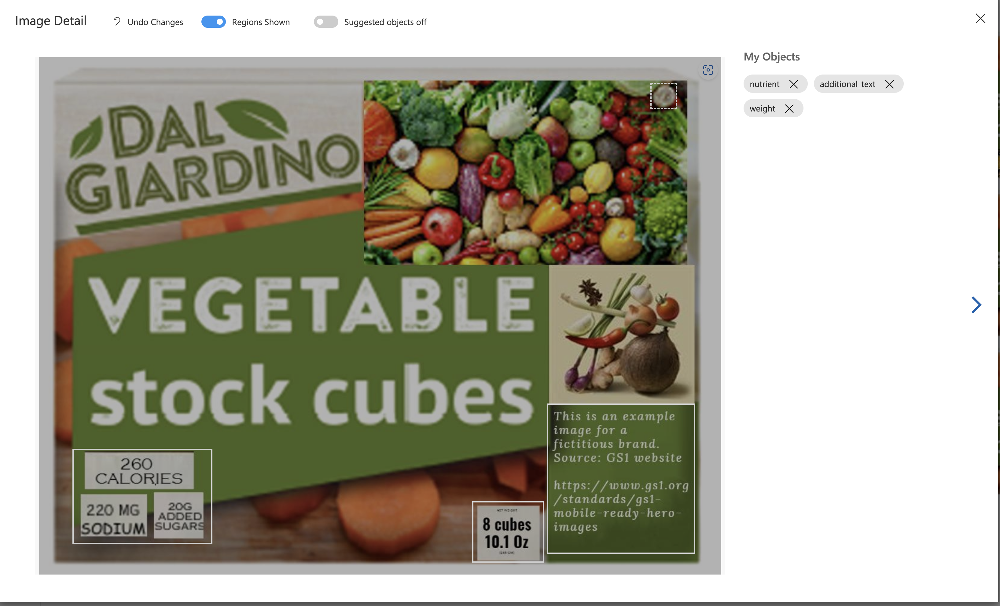
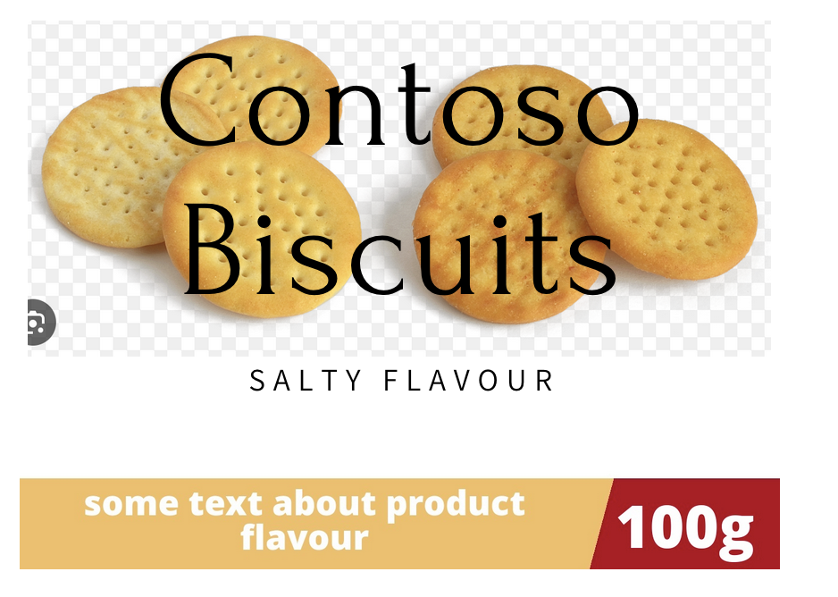

# Introduction

The objective of this project is to experiment around techniques for image inpainting and object removal using the Lama
model.
A more specific use case where this codebase can be useful is generating MRHI compatible images from front pack. MRHI
stands for mobile ready hero images.
This concept is applicable for e-commerce websites where the product images are displayed in a grid view.
As per specification the images need to decluttered to show information required (as per MRHI guideline) for the user to
understand the product.
More details about MRHI can be found at https://www.gs1.org/standards/gs1-mobile-ready-hero-images/current-standard.

## Disclaimer

The code not production ready and is only for experimentation purpose. The code is not optimized for performance and is
not tested for all possible scenarios.
It is ment to be used as a starting point for further experimentation and also to record one of the workflow that can be
used for MRHI generation with help of Azure Cognitive Services.

## High level workflow


For more elaborate workflow please refer to
our [devblog](https://devblogs.microsoft.com/cse/2021/10/13/automating-image-inpainting-for-mrhi-generation/)

## Prerequisites/Assumptions

We won't do deep dive into how to train the custom vision model, and it is expected that the reader is familiar with the
process of training the custom vision model. However there are sample images provided with this project to simulate the
training process. These are highly overfitting images with exact same image used with minor changes to simplify the
demonstration of the process

### Training the custom vision model

There 15 sample images provided with this project to simulate the training of custom vision model. Currently we haven't
provided separate testing images. The only objective of these sample images is to help understand training process.

Below are steps required:-

1) Create a custom vision resource in Azure
2) Create a custom vision project in Azure custom vision resource
3) Upload the sample images to the custom vision project
4) Tag the areas to be removed on the images. In this case we have tagged the areas to be removed with tag "
   nutrients", "additional_text" and "weight" as shown below
   
5) After tagging the images, train the model and publish it on a prediction endpoint. The training will required
   at-least 15 images to be tagged
6) Once the model is trained, we need to get the prediction endpoint and the project id. The prediction endpoint and
   project id can be found in the custom vision resource in Azure portal. We can use below code to programmatically get
   the prediction endpoint and project id

```python
   from azure.cognitiveservices.vision.customvision.prediction import CustomVisionPredictionClient
from msrest.authentication import ApiKeyCredentials

prediction_key = os.environ["CUSTOM_VISION_KEY"]  # Assuming that the prediction key is stored in environment variable
endpoint = os.environ[
   "CUSTOM_VISION_ENDPOINT"]  # Assuming that the prediction endpoint is stored in environment variable
prediction_credentials = ApiKeyCredentials(
   in_headers={"Prediction-key": prediction_key}
)
predictor = CustomVisionPredictionClient(endpoint, prediction_credentials)
results = predictor.detect_image(
   project_id=os.environ["CUSTOM_VISION_PROJECT_ID"],  # Assuming that the project id is stored in environment variable
   published_name=os.environ["CUSTOM_VISION_ITERATION_NAME"],
   # Assuming that the iteration name is stored in environment variable
   image_data=image_bytes,
)
prediction_result = [
   prediction for prediction in results.predictions if prediction.probability > 0.8
   # pick up predictions with confidence level of 80% or more
]

``````

The above code can also be found in the file src/mask.py

## Capabilities

1) Remove on-pack elements from the image. This works well for cases where background color is of single color. In case
   of multi-color background, the results in some cases are not good.
2) Works well for images where generating off-packs lozenges is good enough to be called as MRHI compatible image. The
   format of off-pack lozenges is as below
   
   Here the actual image is not touched, and the off-pack lozenges are generated on the fly. The text and information in
   the lozenges can be provided as input. The colours also can be specified. At the moment the colours are picked up
   from the image itself.

## Setup

1) Install Anaconda
2) Create a conda environment with python 3.10
   `conda create -n mrhi-sample python=3.10 -y`
3) Activate the environment:
   `conda activate mrhi-sample`
3) Run the setup script: `./setup.sh`. This will perform below activities
   1.1) Install lama (https://github.com/advimman/lama) and the required dependencies/pre-trained of Lama model
   1.2) Install the required dependencies of the project
   1.3) Create the required folders for the project
4) Run the streamlit app using `streamlit run streamlitapp.py` from src folder

## Usage

There are two ways to use the project

1) Using the streamlit app

when you run the streamlit app, you will see below screen


There are two sections in the app namely "On-pack" and "Off-pack". The "On-pack" section is used to remove the on-pack
elements from the image. The "Off-pack" section is used to generate the off-pack lozenges.

### On-pack (Pre-requisite: Azure Custom Vision resource is trained with the required images and the areas to be removed are tagged on those images)

The "On-pack" section has two upload image upload options. The first one is for uploading the image to be inpainted. The
second one is for cases where you
have existing MRHI image. This existing MRHI image would be used to compare with generated MRHI image to check how
similar they are. The similarity is calculated using SSIM (Structural Similarity Index). The SSIM value is displayed in
the app. This score will give confidence on how good the generated MRHI image is with respect to ground truth MRHI
image.

It also takes Bottom Lozenge text as input. This text will be used to generate the bottom lozenge. The text is optional.
If not provided, the bottom lozenge will not be generated. The bottom lozenge looks like below (check 8 packs text)


### Off-pack


The "Off-pack" section has option to upload the image. There are two input boxes one where we can put "product name" and
other as "Gramamge". These two inputs will be used to generate the off-pack lozenges. The off-pack lozenges are
generated on the fly. At the moment the colours are picked up from the image itself.

2) Using the command line

There is main.py file in the src folder. This file can be used to run the project from command line. There are two
variables where we need to specify the path of the image to be inpainted and the path of the ground truth image. The
ground truth image is optional.
This is manily intended only for testing purpose.

### Environment variables

VISION_KEY= <Key for Azure computer vision resource>

VISION_ENDPOINT= <Azure computer vision resource endpoint>

CUSTOM_VISION_KEY= <Azure custom vision resouce where the training of images have been done>

CUSTOM_VISION_ENDPOINT= <Azure custom vision prediction endpoint>

CUSTOM_VISION_PROJECT_ID= <Azure custom vision project endpoint>

CUSTOM_VISION_ITERATION_NAME= <Azure custom vision training iteration which is to be used>

VALIDATE=<Do we want to run validation? by default it is false>

EVALUATE=<Do we want to run evaluation? by default it is false>

ONLY_MASK=<Do we want to generate only mask? by default it is false>

